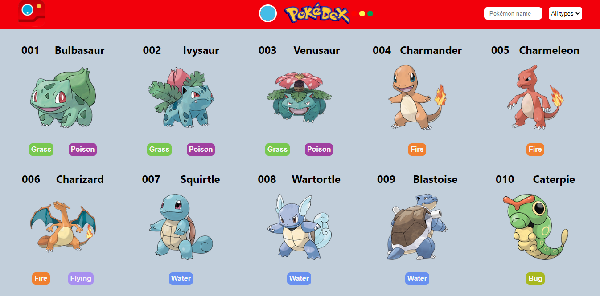
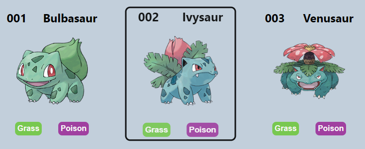
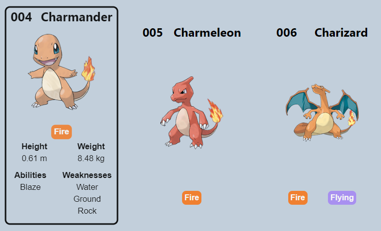
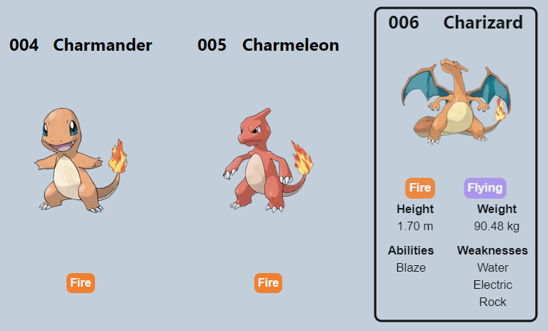
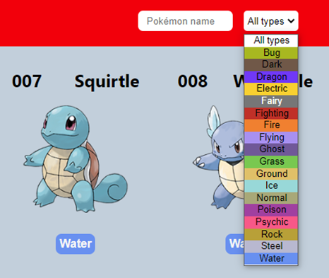
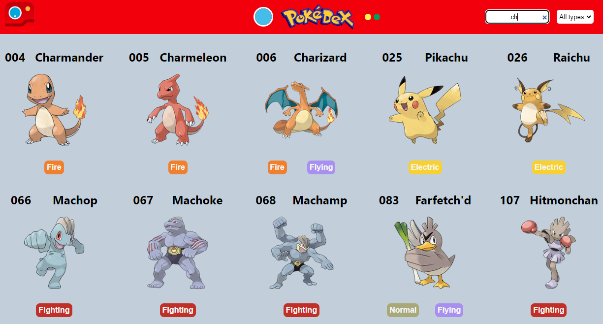
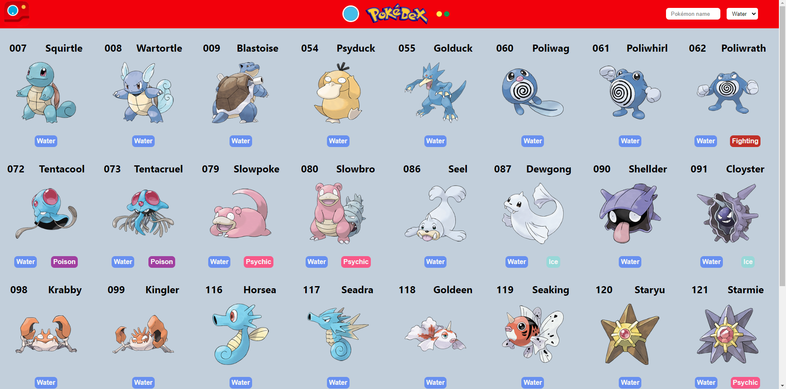

# POKÉDEX

[Ver este proyecto](https://sato31.github.io/coding-pokedex/)

Este proyecto consistió en elaborar un Pokédex con HTML, CSS y JavaScript consumiendo una API local o externa.

En este caso se obtienen los datos de un archivo JSON local, ya que la API oficial mostraba mas de 700 pokémon y varios de ellos eran repetidos. La API local solo se limitó a los primeros 151 pokémon.

Inicialmente se muestra la información básica de los pokémon:

* Número en la Pokédex
* Nombre
* Imagen del Pokémon
* Tipo(s)

Al colocar el cursor del mouse en la tarjeta del pokémon, esta se agranda un poco y se muestra un borde para destacarla.

Al hacer click en la tarjeta, esta se expandirá y se mostrará informacion adicional del pokémon:

* Peso (kg)
* Altura (cm)
* Habilidades
* Debilidades (tipos)

Al hacer click en otro pókemon, se ocultará la información adicional del pokémon anterior y se mostrará la del nuevo pokémon seleccionado.

Se añadio en la barra de navegación un input de búsqueda para poder buscar los pokémon por su nombre y un selector para buscar por tipo.

Mientras se va escribiendo en el input de búsqueda, la página va mostrando los pokémon que coinciden con el nombre escrito.

Si se borra lo que estaba escrito en el input, se volverán a mostrar todos los pokémons.

Si se selecciona un tipo de pokémon en el selector se mostrarán todos los pokémon que coincidadan con ese tipo seleccionado.

